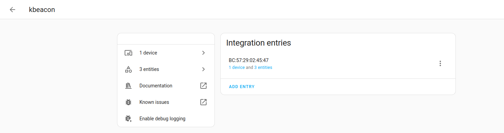
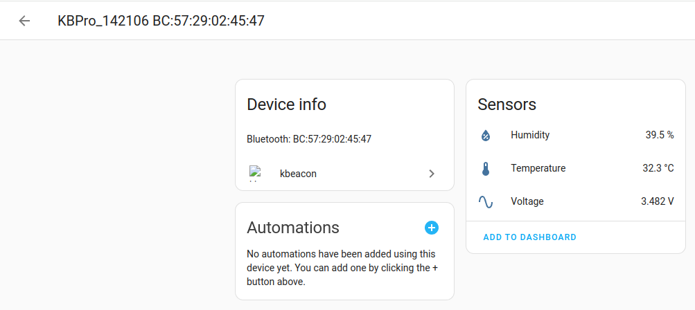

# ha-kbeacon
Home Assistant integration for KBeacon devices

Provides the following:
- Temperature
- Humidity
- Battery voltage

## Installation

### Manual installation (i.e for HA Docker users)
- Clone the repo
- Copy `kbeacon` directory into `home-assistant/config/custom_components/`
- Restart Home Assistant

## Use it
- Home Assistant -> Settings
- Devices & Services
- Add integration
- Search for `kbeacon`
- Follow the on-screen prompt to add your `kbeacon` device